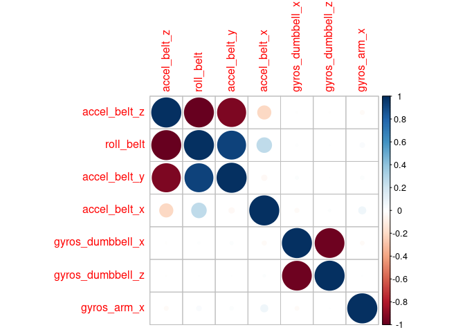
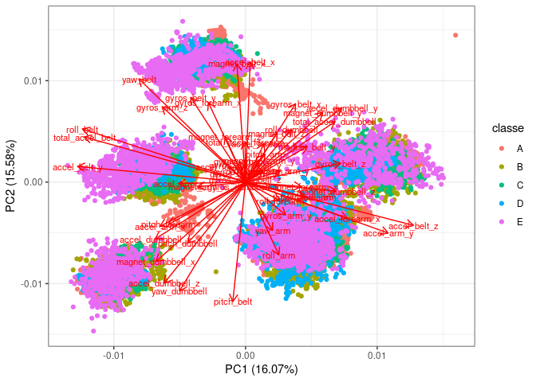
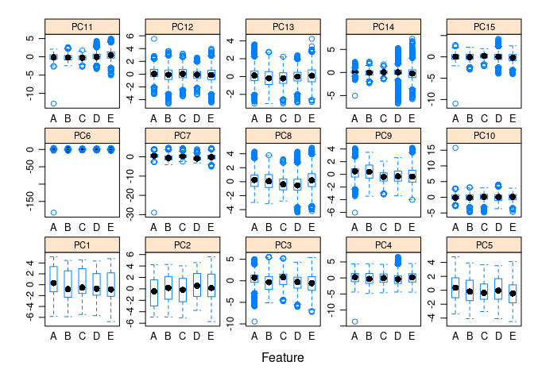

### Outline   
Devices such as Jawbone Up, Nike FuelBand, and Fitbit collect large amounts of data about personal health and activity, but people rarely try to quantify how well they do a particular activity.  
This project's goal is to predict how well the participants in a study performed barbell lifts, based on use data from accelerometers on their belt, forearm, arm, and the dumbell. The 6 participants in the study performed barbell lifts correctly and incorrectly in 5 different ways.  
The data are provided by Velloso et al., 2013, and are available [here](http://groupware.les.inf.puc-rio.br/har), together with more information on the project (Weight Lifting Exercise Dataset).  

#### Dataset citation     
Velloso, E.; Bulling, A.; Gellersen, H.; Ugulino, W.; Fuks, H. Qualitative Activity Recognition of Weight Lifting Exercises. Proceedings of 4th International Conference in Cooperation with SIGCHI (Augmented Human '13). Stuttgart, Germany: ACM SIGCHI, 2013.   

### Setup  
Set up the workspace (root and subdirectory structure) and load packages.  


### Data import and cleaning   
Download and read in the training and test datasets.  


#### Training dataset  
Some of the columns in the training data have "#DIV/0!" which messes up the type detection - I'll set this string as NA on import.   

```
## Warning: Missing column names filled in: 'X1' [1]
```

```
## 
## ── Column specification ────────────────────────────────────────────────────────
## cols(
##   .default = col_double(),
##   user_name = col_character(),
##   cvtd_timestamp = col_character(),
##   new_window = col_character(),
##   kurtosis_yaw_belt = col_logical(),
##   skewness_yaw_belt = col_logical(),
##   kurtosis_yaw_dumbbell = col_logical(),
##   skewness_yaw_dumbbell = col_logical(),
##   kurtosis_yaw_forearm = col_logical(),
##   skewness_yaw_forearm = col_logical(),
##   classe = col_character()
## )
## ℹ Use `spec()` for the full column specifications.
```

The dependent variable (how the exercise was performed) is "classe" - A means it was performed correctly, while the others (B-E) are different types of mistakes.  
The other variables are 1) user names, dates and similar 2) movement data - various accelerations, angles, and derived variances and distributions of these for each sensor - not really documented for this particular dataset beyond the basic description.   


```
## Rows: 19,622
## Columns: 160
## $ X1                       <dbl> 1, 2, 3, 4, 5, 6, 7, 8, 9, 10, 11, 12, 13, 14…
## $ user_name                <chr> "carlitos", "carlitos", "carlitos", "carlitos…
## $ raw_timestamp_part_1     <dbl> 1323084231, 1323084231, 1323084231, 132308423…
## $ raw_timestamp_part_2     <dbl> 788290, 808298, 820366, 120339, 196328, 30427…
## $ cvtd_timestamp           <chr> "05/12/2011 11:23", "05/12/2011 11:23", "05/1…
## $ new_window               <chr> "no", "no", "no", "no", "no", "no", "no", "no…
## $ num_window               <dbl> 11, 11, 11, 12, 12, 12, 12, 12, 12, 12, 12, 1…
## $ roll_belt                <dbl> 1.41, 1.41, 1.42, 1.48, 1.48, 1.45, 1.42, 1.4…
## $ pitch_belt               <dbl> 8.07, 8.07, 8.07, 8.05, 8.07, 8.06, 8.09, 8.1…
## $ yaw_belt                 <dbl> -94.4, -94.4, -94.4, -94.4, -94.4, -94.4, -94…
## $ total_accel_belt         <dbl> 3, 3, 3, 3, 3, 3, 3, 3, 3, 3, 3, 3, 3, 3, 3, …
## $ kurtosis_roll_belt       <dbl> NA, NA, NA, NA, NA, NA, NA, NA, NA, NA, NA, N…
## $ kurtosis_picth_belt      <dbl> NA, NA, NA, NA, NA, NA, NA, NA, NA, NA, NA, N…
## $ kurtosis_yaw_belt        <lgl> NA, NA, NA, NA, NA, NA, NA, NA, NA, NA, NA, N…
## $ skewness_roll_belt       <dbl> NA, NA, NA, NA, NA, NA, NA, NA, NA, NA, NA, N…
## $ skewness_roll_belt.1     <dbl> NA, NA, NA, NA, NA, NA, NA, NA, NA, NA, NA, N…
## $ skewness_yaw_belt        <lgl> NA, NA, NA, NA, NA, NA, NA, NA, NA, NA, NA, N…
## $ max_roll_belt            <dbl> NA, NA, NA, NA, NA, NA, NA, NA, NA, NA, NA, N…
## $ max_picth_belt           <dbl> NA, NA, NA, NA, NA, NA, NA, NA, NA, NA, NA, N…
## $ max_yaw_belt             <dbl> NA, NA, NA, NA, NA, NA, NA, NA, NA, NA, NA, N…
## $ min_roll_belt            <dbl> NA, NA, NA, NA, NA, NA, NA, NA, NA, NA, NA, N…
## $ min_pitch_belt           <dbl> NA, NA, NA, NA, NA, NA, NA, NA, NA, NA, NA, N…
## $ min_yaw_belt             <dbl> NA, NA, NA, NA, NA, NA, NA, NA, NA, NA, NA, N…
## $ amplitude_roll_belt      <dbl> NA, NA, NA, NA, NA, NA, NA, NA, NA, NA, NA, N…
## $ amplitude_pitch_belt     <dbl> NA, NA, NA, NA, NA, NA, NA, NA, NA, NA, NA, N…
## $ amplitude_yaw_belt       <dbl> NA, NA, NA, NA, NA, NA, NA, NA, NA, NA, NA, N…
## $ var_total_accel_belt     <dbl> NA, NA, NA, NA, NA, NA, NA, NA, NA, NA, NA, N…
## $ avg_roll_belt            <dbl> NA, NA, NA, NA, NA, NA, NA, NA, NA, NA, NA, N…
## $ stddev_roll_belt         <dbl> NA, NA, NA, NA, NA, NA, NA, NA, NA, NA, NA, N…
## $ var_roll_belt            <dbl> NA, NA, NA, NA, NA, NA, NA, NA, NA, NA, NA, N…
## $ avg_pitch_belt           <dbl> NA, NA, NA, NA, NA, NA, NA, NA, NA, NA, NA, N…
## $ stddev_pitch_belt        <dbl> NA, NA, NA, NA, NA, NA, NA, NA, NA, NA, NA, N…
## $ var_pitch_belt           <dbl> NA, NA, NA, NA, NA, NA, NA, NA, NA, NA, NA, N…
## $ avg_yaw_belt             <dbl> NA, NA, NA, NA, NA, NA, NA, NA, NA, NA, NA, N…
## $ stddev_yaw_belt          <dbl> NA, NA, NA, NA, NA, NA, NA, NA, NA, NA, NA, N…
## $ var_yaw_belt             <dbl> NA, NA, NA, NA, NA, NA, NA, NA, NA, NA, NA, N…
## $ gyros_belt_x             <dbl> 0.00, 0.02, 0.00, 0.02, 0.02, 0.02, 0.02, 0.0…
## $ gyros_belt_y             <dbl> 0.00, 0.00, 0.00, 0.00, 0.02, 0.00, 0.00, 0.0…
## $ gyros_belt_z             <dbl> -0.02, -0.02, -0.02, -0.03, -0.02, -0.02, -0.…
## $ accel_belt_x             <dbl> -21, -22, -20, -22, -21, -21, -22, -22, -20, …
## $ accel_belt_y             <dbl> 4, 4, 5, 3, 2, 4, 3, 4, 2, 4, 2, 2, 4, 4, 2, …
## $ accel_belt_z             <dbl> 22, 22, 23, 21, 24, 21, 21, 21, 24, 22, 23, 2…
## $ magnet_belt_x            <dbl> -3, -7, -2, -6, -6, 0, -4, -2, 1, -3, -5, -2,…
## $ magnet_belt_y            <dbl> 599, 608, 600, 604, 600, 603, 599, 603, 602, …
## $ magnet_belt_z            <dbl> -313, -311, -305, -310, -302, -312, -311, -31…
## $ roll_arm                 <dbl> -128, -128, -128, -128, -128, -128, -128, -12…
## $ pitch_arm                <dbl> 22.5, 22.5, 22.5, 22.1, 22.1, 22.0, 21.9, 21.…
## $ yaw_arm                  <dbl> -161, -161, -161, -161, -161, -161, -161, -16…
## $ total_accel_arm          <dbl> 34, 34, 34, 34, 34, 34, 34, 34, 34, 34, 34, 3…
## $ var_accel_arm            <dbl> NA, NA, NA, NA, NA, NA, NA, NA, NA, NA, NA, N…
## $ avg_roll_arm             <dbl> NA, NA, NA, NA, NA, NA, NA, NA, NA, NA, NA, N…
## $ stddev_roll_arm          <dbl> NA, NA, NA, NA, NA, NA, NA, NA, NA, NA, NA, N…
## $ var_roll_arm             <dbl> NA, NA, NA, NA, NA, NA, NA, NA, NA, NA, NA, N…
## $ avg_pitch_arm            <dbl> NA, NA, NA, NA, NA, NA, NA, NA, NA, NA, NA, N…
## $ stddev_pitch_arm         <dbl> NA, NA, NA, NA, NA, NA, NA, NA, NA, NA, NA, N…
## $ var_pitch_arm            <dbl> NA, NA, NA, NA, NA, NA, NA, NA, NA, NA, NA, N…
## $ avg_yaw_arm              <dbl> NA, NA, NA, NA, NA, NA, NA, NA, NA, NA, NA, N…
## $ stddev_yaw_arm           <dbl> NA, NA, NA, NA, NA, NA, NA, NA, NA, NA, NA, N…
## $ var_yaw_arm              <dbl> NA, NA, NA, NA, NA, NA, NA, NA, NA, NA, NA, N…
## $ gyros_arm_x              <dbl> 0.00, 0.02, 0.02, 0.02, 0.00, 0.02, 0.00, 0.0…
## $ gyros_arm_y              <dbl> 0.00, -0.02, -0.02, -0.03, -0.03, -0.03, -0.0…
## $ gyros_arm_z              <dbl> -0.02, -0.02, -0.02, 0.02, 0.00, 0.00, 0.00, …
## $ accel_arm_x              <dbl> -288, -290, -289, -289, -289, -289, -289, -28…
## $ accel_arm_y              <dbl> 109, 110, 110, 111, 111, 111, 111, 111, 109, …
## $ accel_arm_z              <dbl> -123, -125, -126, -123, -123, -122, -125, -12…
## $ magnet_arm_x             <dbl> -368, -369, -368, -372, -374, -369, -373, -37…
## $ magnet_arm_y             <dbl> 337, 337, 344, 344, 337, 342, 336, 338, 341, …
## $ magnet_arm_z             <dbl> 516, 513, 513, 512, 506, 513, 509, 510, 518, …
## $ kurtosis_roll_arm        <dbl> NA, NA, NA, NA, NA, NA, NA, NA, NA, NA, NA, N…
## $ kurtosis_picth_arm       <dbl> NA, NA, NA, NA, NA, NA, NA, NA, NA, NA, NA, N…
## $ kurtosis_yaw_arm         <dbl> NA, NA, NA, NA, NA, NA, NA, NA, NA, NA, NA, N…
## $ skewness_roll_arm        <dbl> NA, NA, NA, NA, NA, NA, NA, NA, NA, NA, NA, N…
## $ skewness_pitch_arm       <dbl> NA, NA, NA, NA, NA, NA, NA, NA, NA, NA, NA, N…
## $ skewness_yaw_arm         <dbl> NA, NA, NA, NA, NA, NA, NA, NA, NA, NA, NA, N…
## $ max_roll_arm             <dbl> NA, NA, NA, NA, NA, NA, NA, NA, NA, NA, NA, N…
## $ max_picth_arm            <dbl> NA, NA, NA, NA, NA, NA, NA, NA, NA, NA, NA, N…
## $ max_yaw_arm              <dbl> NA, NA, NA, NA, NA, NA, NA, NA, NA, NA, NA, N…
## $ min_roll_arm             <dbl> NA, NA, NA, NA, NA, NA, NA, NA, NA, NA, NA, N…
## $ min_pitch_arm            <dbl> NA, NA, NA, NA, NA, NA, NA, NA, NA, NA, NA, N…
## $ min_yaw_arm              <dbl> NA, NA, NA, NA, NA, NA, NA, NA, NA, NA, NA, N…
## $ amplitude_roll_arm       <dbl> NA, NA, NA, NA, NA, NA, NA, NA, NA, NA, NA, N…
## $ amplitude_pitch_arm      <dbl> NA, NA, NA, NA, NA, NA, NA, NA, NA, NA, NA, N…
## $ amplitude_yaw_arm        <dbl> NA, NA, NA, NA, NA, NA, NA, NA, NA, NA, NA, N…
## $ roll_dumbbell            <dbl> 13.05217, 13.13074, 12.85075, 13.43120, 13.37…
## $ pitch_dumbbell           <dbl> -70.49400, -70.63751, -70.27812, -70.39379, -…
## $ yaw_dumbbell             <dbl> -84.87394, -84.71065, -85.14078, -84.87363, -…
## $ kurtosis_roll_dumbbell   <dbl> NA, NA, NA, NA, NA, NA, NA, NA, NA, NA, NA, N…
## $ kurtosis_picth_dumbbell  <dbl> NA, NA, NA, NA, NA, NA, NA, NA, NA, NA, NA, N…
## $ kurtosis_yaw_dumbbell    <lgl> NA, NA, NA, NA, NA, NA, NA, NA, NA, NA, NA, N…
## $ skewness_roll_dumbbell   <dbl> NA, NA, NA, NA, NA, NA, NA, NA, NA, NA, NA, N…
## $ skewness_pitch_dumbbell  <dbl> NA, NA, NA, NA, NA, NA, NA, NA, NA, NA, NA, N…
## $ skewness_yaw_dumbbell    <lgl> NA, NA, NA, NA, NA, NA, NA, NA, NA, NA, NA, N…
## $ max_roll_dumbbell        <dbl> NA, NA, NA, NA, NA, NA, NA, NA, NA, NA, NA, N…
## $ max_picth_dumbbell       <dbl> NA, NA, NA, NA, NA, NA, NA, NA, NA, NA, NA, N…
## $ max_yaw_dumbbell         <dbl> NA, NA, NA, NA, NA, NA, NA, NA, NA, NA, NA, N…
## $ min_roll_dumbbell        <dbl> NA, NA, NA, NA, NA, NA, NA, NA, NA, NA, NA, N…
## $ min_pitch_dumbbell       <dbl> NA, NA, NA, NA, NA, NA, NA, NA, NA, NA, NA, N…
## $ min_yaw_dumbbell         <dbl> NA, NA, NA, NA, NA, NA, NA, NA, NA, NA, NA, N…
## $ amplitude_roll_dumbbell  <dbl> NA, NA, NA, NA, NA, NA, NA, NA, NA, NA, NA, N…
## $ amplitude_pitch_dumbbell <dbl> NA, NA, NA, NA, NA, NA, NA, NA, NA, NA, NA, N…
## $ amplitude_yaw_dumbbell   <dbl> NA, NA, NA, NA, NA, NA, NA, NA, NA, NA, NA, N…
## $ total_accel_dumbbell     <dbl> 37, 37, 37, 37, 37, 37, 37, 37, 37, 37, 37, 3…
## $ var_accel_dumbbell       <dbl> NA, NA, NA, NA, NA, NA, NA, NA, NA, NA, NA, N…
## $ avg_roll_dumbbell        <dbl> NA, NA, NA, NA, NA, NA, NA, NA, NA, NA, NA, N…
## $ stddev_roll_dumbbell     <dbl> NA, NA, NA, NA, NA, NA, NA, NA, NA, NA, NA, N…
## $ var_roll_dumbbell        <dbl> NA, NA, NA, NA, NA, NA, NA, NA, NA, NA, NA, N…
## $ avg_pitch_dumbbell       <dbl> NA, NA, NA, NA, NA, NA, NA, NA, NA, NA, NA, N…
## $ stddev_pitch_dumbbell    <dbl> NA, NA, NA, NA, NA, NA, NA, NA, NA, NA, NA, N…
## $ var_pitch_dumbbell       <dbl> NA, NA, NA, NA, NA, NA, NA, NA, NA, NA, NA, N…
## $ avg_yaw_dumbbell         <dbl> NA, NA, NA, NA, NA, NA, NA, NA, NA, NA, NA, N…
## $ stddev_yaw_dumbbell      <dbl> NA, NA, NA, NA, NA, NA, NA, NA, NA, NA, NA, N…
## $ var_yaw_dumbbell         <dbl> NA, NA, NA, NA, NA, NA, NA, NA, NA, NA, NA, N…
## $ gyros_dumbbell_x         <dbl> 0.00, 0.00, 0.00, 0.00, 0.00, 0.00, 0.00, 0.0…
## $ gyros_dumbbell_y         <dbl> -0.02, -0.02, -0.02, -0.02, -0.02, -0.02, -0.…
## $ gyros_dumbbell_z         <dbl> 0.00, 0.00, 0.00, -0.02, 0.00, 0.00, 0.00, 0.…
## $ accel_dumbbell_x         <dbl> -234, -233, -232, -232, -233, -234, -232, -23…
## $ accel_dumbbell_y         <dbl> 47, 47, 46, 48, 48, 48, 47, 46, 47, 48, 47, 4…
## $ accel_dumbbell_z         <dbl> -271, -269, -270, -269, -270, -269, -270, -27…
## $ magnet_dumbbell_x        <dbl> -559, -555, -561, -552, -554, -558, -551, -55…
## $ magnet_dumbbell_y        <dbl> 293, 296, 298, 303, 292, 294, 295, 300, 292, …
## $ magnet_dumbbell_z        <dbl> -65, -64, -63, -60, -68, -66, -70, -74, -65, …
## $ roll_forearm             <dbl> 28.4, 28.3, 28.3, 28.1, 28.0, 27.9, 27.9, 27.…
## $ pitch_forearm            <dbl> -63.9, -63.9, -63.9, -63.9, -63.9, -63.9, -63…
## $ yaw_forearm              <dbl> -153, -153, -152, -152, -152, -152, -152, -15…
## $ kurtosis_roll_forearm    <dbl> NA, NA, NA, NA, NA, NA, NA, NA, NA, NA, NA, N…
## $ kurtosis_picth_forearm   <dbl> NA, NA, NA, NA, NA, NA, NA, NA, NA, NA, NA, N…
## $ kurtosis_yaw_forearm     <lgl> NA, NA, NA, NA, NA, NA, NA, NA, NA, NA, NA, N…
## $ skewness_roll_forearm    <dbl> NA, NA, NA, NA, NA, NA, NA, NA, NA, NA, NA, N…
## $ skewness_pitch_forearm   <dbl> NA, NA, NA, NA, NA, NA, NA, NA, NA, NA, NA, N…
## $ skewness_yaw_forearm     <lgl> NA, NA, NA, NA, NA, NA, NA, NA, NA, NA, NA, N…
## $ max_roll_forearm         <dbl> NA, NA, NA, NA, NA, NA, NA, NA, NA, NA, NA, N…
## $ max_picth_forearm        <dbl> NA, NA, NA, NA, NA, NA, NA, NA, NA, NA, NA, N…
## $ max_yaw_forearm          <dbl> NA, NA, NA, NA, NA, NA, NA, NA, NA, NA, NA, N…
## $ min_roll_forearm         <dbl> NA, NA, NA, NA, NA, NA, NA, NA, NA, NA, NA, N…
## $ min_pitch_forearm        <dbl> NA, NA, NA, NA, NA, NA, NA, NA, NA, NA, NA, N…
## $ min_yaw_forearm          <dbl> NA, NA, NA, NA, NA, NA, NA, NA, NA, NA, NA, N…
## $ amplitude_roll_forearm   <dbl> NA, NA, NA, NA, NA, NA, NA, NA, NA, NA, NA, N…
## $ amplitude_pitch_forearm  <dbl> NA, NA, NA, NA, NA, NA, NA, NA, NA, NA, NA, N…
## $ amplitude_yaw_forearm    <dbl> NA, NA, NA, NA, NA, NA, NA, NA, NA, NA, NA, N…
## $ total_accel_forearm      <dbl> 36, 36, 36, 36, 36, 36, 36, 36, 36, 36, 36, 3…
## $ var_accel_forearm        <dbl> NA, NA, NA, NA, NA, NA, NA, NA, NA, NA, NA, N…
## $ avg_roll_forearm         <dbl> NA, NA, NA, NA, NA, NA, NA, NA, NA, NA, NA, N…
## $ stddev_roll_forearm      <dbl> NA, NA, NA, NA, NA, NA, NA, NA, NA, NA, NA, N…
## $ var_roll_forearm         <dbl> NA, NA, NA, NA, NA, NA, NA, NA, NA, NA, NA, N…
## $ avg_pitch_forearm        <dbl> NA, NA, NA, NA, NA, NA, NA, NA, NA, NA, NA, N…
## $ stddev_pitch_forearm     <dbl> NA, NA, NA, NA, NA, NA, NA, NA, NA, NA, NA, N…
## $ var_pitch_forearm        <dbl> NA, NA, NA, NA, NA, NA, NA, NA, NA, NA, NA, N…
## $ avg_yaw_forearm          <dbl> NA, NA, NA, NA, NA, NA, NA, NA, NA, NA, NA, N…
## $ stddev_yaw_forearm       <dbl> NA, NA, NA, NA, NA, NA, NA, NA, NA, NA, NA, N…
## $ var_yaw_forearm          <dbl> NA, NA, NA, NA, NA, NA, NA, NA, NA, NA, NA, N…
## $ gyros_forearm_x          <dbl> 0.03, 0.02, 0.03, 0.02, 0.02, 0.02, 0.02, 0.0…
## $ gyros_forearm_y          <dbl> 0.00, 0.00, -0.02, -0.02, 0.00, -0.02, 0.00, …
## $ gyros_forearm_z          <dbl> -0.02, -0.02, 0.00, 0.00, -0.02, -0.03, -0.02…
## $ accel_forearm_x          <dbl> 192, 192, 196, 189, 189, 193, 195, 193, 193, …
## $ accel_forearm_y          <dbl> 203, 203, 204, 206, 206, 203, 205, 205, 204, …
## $ accel_forearm_z          <dbl> -215, -216, -213, -214, -214, -215, -215, -21…
## $ magnet_forearm_x         <dbl> -17, -18, -18, -16, -17, -9, -18, -9, -16, -2…
## $ magnet_forearm_y         <dbl> 654, 661, 658, 658, 655, 660, 659, 660, 653, …
## $ magnet_forearm_z         <dbl> 476, 473, 469, 469, 473, 478, 470, 474, 476, …
## $ classe                   <chr> "A", "A", "A", "A", "A", "A", "A", "A", "A", …
```

Some columns are automatically recognized as "logical" class - that's usually because they're all-NA. They were dropped after checking that they were indeed all NAs, because they wouldn't be of much value for this project.   

```
##  kurtosis_yaw_belt skewness_yaw_belt kurtosis_yaw_dumbbell
##  Mode:logical      Mode:logical      Mode:logical         
##  NA's:19622        NA's:19622        NA's:19622           
##  skewness_yaw_dumbbell kurtosis_yaw_forearm skewness_yaw_forearm
##  Mode:logical          Mode:logical         Mode:logical        
##  NA's:19622            NA's:19622           NA's:19622
```


The timestamps and similar variables were also dropped, but the user names were kept, in case the way the exercises were performed differed sufficiently between users to be worth exploring.   
The dependent variable was converted to factor (it was initially character).  


Variables consisting of >50% NAs were also dropped instead of trying to impute the missing values, because that would have probably introduced too much extra noise.  

```
## # A tibble: 146 x 3
##    variable             na_count prop_na
##    <chr>                   <int>   <dbl>
##  1 roll_belt                   0   0    
##  2 pitch_belt                  0   0    
##  3 yaw_belt                    0   0    
##  4 total_accel_belt            0   0    
##  5 kurtosis_roll_belt      19226   0.980
##  6 kurtosis_picth_belt     19248   0.981
##  7 skewness_roll_belt      19225   0.980
##  8 skewness_roll_belt.1    19248   0.981
##  9 max_roll_belt           19216   0.979
## 10 max_picth_belt          19216   0.979
## # … with 136 more rows
```

This left about 52 variables to use for predicting.  


#### Testing dataset   

```
## Warning: Missing column names filled in: 'X1' [1]
```

```
## 
## ── Column specification ────────────────────────────────────────────────────────
## cols(
##   .default = col_logical(),
##   X1 = col_double(),
##   user_name = col_character(),
##   raw_timestamp_part_1 = col_double(),
##   raw_timestamp_part_2 = col_double(),
##   cvtd_timestamp = col_character(),
##   new_window = col_character(),
##   num_window = col_double(),
##   roll_belt = col_double(),
##   pitch_belt = col_double(),
##   yaw_belt = col_double(),
##   total_accel_belt = col_double(),
##   gyros_belt_x = col_double(),
##   gyros_belt_y = col_double(),
##   gyros_belt_z = col_double(),
##   accel_belt_x = col_double(),
##   accel_belt_y = col_double(),
##   accel_belt_z = col_double(),
##   magnet_belt_x = col_double(),
##   magnet_belt_y = col_double(),
##   magnet_belt_z = col_double()
##   # ... with 40 more columns
## )
## ℹ Use `spec()` for the full column specifications.
```


```
## Rows: 20
## Columns: 160
## $ X1                       <dbl> 1, 2, 3, 4, 5, 6, 7, 8, 9, 10, 11, 12, 13, 14…
## $ user_name                <chr> "pedro", "jeremy", "jeremy", "adelmo", "euric…
## $ raw_timestamp_part_1     <dbl> 1323095002, 1322673067, 1322673075, 132283278…
## $ raw_timestamp_part_2     <dbl> 868349, 778725, 342967, 560311, 814776, 51066…
## $ cvtd_timestamp           <chr> "05/12/2011 14:23", "30/11/2011 17:11", "30/1…
## $ new_window               <chr> "no", "no", "no", "no", "no", "no", "no", "no…
## $ num_window               <dbl> 74, 431, 439, 194, 235, 504, 485, 440, 323, 6…
## $ roll_belt                <dbl> 123.00, 1.02, 0.87, 125.00, 1.35, -5.92, 1.20…
## $ pitch_belt               <dbl> 27.00, 4.87, 1.82, -41.60, 3.33, 1.59, 4.44, …
## $ yaw_belt                 <dbl> -4.75, -88.90, -88.50, 162.00, -88.60, -87.70…
## $ total_accel_belt         <dbl> 20, 4, 5, 17, 3, 4, 4, 4, 4, 18, 3, 5, 3, 5, …
## $ kurtosis_roll_belt       <lgl> NA, NA, NA, NA, NA, NA, NA, NA, NA, NA, NA, N…
## $ kurtosis_picth_belt      <lgl> NA, NA, NA, NA, NA, NA, NA, NA, NA, NA, NA, N…
## $ kurtosis_yaw_belt        <lgl> NA, NA, NA, NA, NA, NA, NA, NA, NA, NA, NA, N…
## $ skewness_roll_belt       <lgl> NA, NA, NA, NA, NA, NA, NA, NA, NA, NA, NA, N…
## $ skewness_roll_belt.1     <lgl> NA, NA, NA, NA, NA, NA, NA, NA, NA, NA, NA, N…
## $ skewness_yaw_belt        <lgl> NA, NA, NA, NA, NA, NA, NA, NA, NA, NA, NA, N…
## $ max_roll_belt            <lgl> NA, NA, NA, NA, NA, NA, NA, NA, NA, NA, NA, N…
## $ max_picth_belt           <lgl> NA, NA, NA, NA, NA, NA, NA, NA, NA, NA, NA, N…
## $ max_yaw_belt             <lgl> NA, NA, NA, NA, NA, NA, NA, NA, NA, NA, NA, N…
## $ min_roll_belt            <lgl> NA, NA, NA, NA, NA, NA, NA, NA, NA, NA, NA, N…
## $ min_pitch_belt           <lgl> NA, NA, NA, NA, NA, NA, NA, NA, NA, NA, NA, N…
## $ min_yaw_belt             <lgl> NA, NA, NA, NA, NA, NA, NA, NA, NA, NA, NA, N…
## $ amplitude_roll_belt      <lgl> NA, NA, NA, NA, NA, NA, NA, NA, NA, NA, NA, N…
## $ amplitude_pitch_belt     <lgl> NA, NA, NA, NA, NA, NA, NA, NA, NA, NA, NA, N…
## $ amplitude_yaw_belt       <lgl> NA, NA, NA, NA, NA, NA, NA, NA, NA, NA, NA, N…
## $ var_total_accel_belt     <lgl> NA, NA, NA, NA, NA, NA, NA, NA, NA, NA, NA, N…
## $ avg_roll_belt            <lgl> NA, NA, NA, NA, NA, NA, NA, NA, NA, NA, NA, N…
## $ stddev_roll_belt         <lgl> NA, NA, NA, NA, NA, NA, NA, NA, NA, NA, NA, N…
## $ var_roll_belt            <lgl> NA, NA, NA, NA, NA, NA, NA, NA, NA, NA, NA, N…
## $ avg_pitch_belt           <lgl> NA, NA, NA, NA, NA, NA, NA, NA, NA, NA, NA, N…
## $ stddev_pitch_belt        <lgl> NA, NA, NA, NA, NA, NA, NA, NA, NA, NA, NA, N…
## $ var_pitch_belt           <lgl> NA, NA, NA, NA, NA, NA, NA, NA, NA, NA, NA, N…
## $ avg_yaw_belt             <lgl> NA, NA, NA, NA, NA, NA, NA, NA, NA, NA, NA, N…
## $ stddev_yaw_belt          <lgl> NA, NA, NA, NA, NA, NA, NA, NA, NA, NA, NA, N…
## $ var_yaw_belt             <lgl> NA, NA, NA, NA, NA, NA, NA, NA, NA, NA, NA, N…
## $ gyros_belt_x             <dbl> -0.50, -0.06, 0.05, 0.11, 0.03, 0.10, -0.06, …
## $ gyros_belt_y             <dbl> -0.02, -0.02, 0.02, 0.11, 0.02, 0.05, 0.00, -…
## $ gyros_belt_z             <dbl> -0.46, -0.07, 0.03, -0.16, 0.00, -0.13, 0.00,…
## $ accel_belt_x             <dbl> -38, -13, 1, 46, -8, -11, -14, -10, -15, -25,…
## $ accel_belt_y             <dbl> 69, 11, -1, 45, 4, -16, 2, -2, 1, 63, 4, 8, 5…
## $ accel_belt_z             <dbl> -179, 39, 49, -156, 27, 38, 35, 42, 32, -158,…
## $ magnet_belt_x            <dbl> -13, 43, 29, 169, 33, 31, 50, 39, -6, 10, 6, …
## $ magnet_belt_y            <dbl> 581, 636, 631, 608, 566, 638, 622, 635, 600, …
## $ magnet_belt_z            <dbl> -382, -309, -312, -304, -418, -291, -315, -30…
## $ roll_arm                 <dbl> 40.70, 0.00, 0.00, -109.00, 76.10, 0.00, 0.00…
## $ pitch_arm                <dbl> -27.80, 0.00, 0.00, 55.00, 2.76, 0.00, 0.00, …
## $ yaw_arm                  <dbl> 178.0, 0.0, 0.0, -142.0, 102.0, 0.0, 0.0, 0.0…
## $ total_accel_arm          <dbl> 10, 38, 44, 25, 29, 14, 15, 22, 34, 32, 33, 3…
## $ var_accel_arm            <lgl> NA, NA, NA, NA, NA, NA, NA, NA, NA, NA, NA, N…
## $ avg_roll_arm             <lgl> NA, NA, NA, NA, NA, NA, NA, NA, NA, NA, NA, N…
## $ stddev_roll_arm          <lgl> NA, NA, NA, NA, NA, NA, NA, NA, NA, NA, NA, N…
## $ var_roll_arm             <lgl> NA, NA, NA, NA, NA, NA, NA, NA, NA, NA, NA, N…
## $ avg_pitch_arm            <lgl> NA, NA, NA, NA, NA, NA, NA, NA, NA, NA, NA, N…
## $ stddev_pitch_arm         <lgl> NA, NA, NA, NA, NA, NA, NA, NA, NA, NA, NA, N…
## $ var_pitch_arm            <lgl> NA, NA, NA, NA, NA, NA, NA, NA, NA, NA, NA, N…
## $ avg_yaw_arm              <lgl> NA, NA, NA, NA, NA, NA, NA, NA, NA, NA, NA, N…
## $ stddev_yaw_arm           <lgl> NA, NA, NA, NA, NA, NA, NA, NA, NA, NA, NA, N…
## $ var_yaw_arm              <lgl> NA, NA, NA, NA, NA, NA, NA, NA, NA, NA, NA, N…
## $ gyros_arm_x              <dbl> -1.65, -1.17, 2.10, 0.22, -1.96, 0.02, 2.36, …
## $ gyros_arm_y              <dbl> 0.48, 0.85, -1.36, -0.51, 0.79, 0.05, -1.01, …
## $ gyros_arm_z              <dbl> -0.18, -0.43, 1.13, 0.92, -0.54, -0.07, 0.89,…
## $ accel_arm_x              <dbl> 16, -290, -341, -238, -197, -26, 99, -98, -28…
## $ accel_arm_y              <dbl> 38, 215, 245, -57, 200, 130, 79, 175, 111, -4…
## $ accel_arm_z              <dbl> 93, -90, -87, 6, -30, -19, -67, -78, -122, -8…
## $ magnet_arm_x             <dbl> -326, -325, -264, -173, -170, 396, 702, 535, …
## $ magnet_arm_y             <dbl> 385, 447, 474, 257, 275, 176, 15, 215, 335, 2…
## $ magnet_arm_z             <dbl> 481, 434, 413, 633, 617, 516, 217, 385, 520, …
## $ kurtosis_roll_arm        <lgl> NA, NA, NA, NA, NA, NA, NA, NA, NA, NA, NA, N…
## $ kurtosis_picth_arm       <lgl> NA, NA, NA, NA, NA, NA, NA, NA, NA, NA, NA, N…
## $ kurtosis_yaw_arm         <lgl> NA, NA, NA, NA, NA, NA, NA, NA, NA, NA, NA, N…
## $ skewness_roll_arm        <lgl> NA, NA, NA, NA, NA, NA, NA, NA, NA, NA, NA, N…
## $ skewness_pitch_arm       <lgl> NA, NA, NA, NA, NA, NA, NA, NA, NA, NA, NA, N…
## $ skewness_yaw_arm         <lgl> NA, NA, NA, NA, NA, NA, NA, NA, NA, NA, NA, N…
## $ max_roll_arm             <lgl> NA, NA, NA, NA, NA, NA, NA, NA, NA, NA, NA, N…
## $ max_picth_arm            <lgl> NA, NA, NA, NA, NA, NA, NA, NA, NA, NA, NA, N…
## $ max_yaw_arm              <lgl> NA, NA, NA, NA, NA, NA, NA, NA, NA, NA, NA, N…
## $ min_roll_arm             <lgl> NA, NA, NA, NA, NA, NA, NA, NA, NA, NA, NA, N…
## $ min_pitch_arm            <lgl> NA, NA, NA, NA, NA, NA, NA, NA, NA, NA, NA, N…
## $ min_yaw_arm              <lgl> NA, NA, NA, NA, NA, NA, NA, NA, NA, NA, NA, N…
## $ amplitude_roll_arm       <lgl> NA, NA, NA, NA, NA, NA, NA, NA, NA, NA, NA, N…
## $ amplitude_pitch_arm      <lgl> NA, NA, NA, NA, NA, NA, NA, NA, NA, NA, NA, N…
## $ amplitude_yaw_arm        <lgl> NA, NA, NA, NA, NA, NA, NA, NA, NA, NA, NA, N…
## $ roll_dumbbell            <dbl> -17.737480, 54.477605, 57.070308, 43.109268, …
## $ pitch_dumbbell           <dbl> 24.96085, -53.69758, -51.37303, -30.04885, -5…
## $ yaw_dumbbell             <dbl> 126.235964, -75.514799, -75.202873, -103.3200…
## $ kurtosis_roll_dumbbell   <lgl> NA, NA, NA, NA, NA, NA, NA, NA, NA, NA, NA, N…
## $ kurtosis_picth_dumbbell  <lgl> NA, NA, NA, NA, NA, NA, NA, NA, NA, NA, NA, N…
## $ kurtosis_yaw_dumbbell    <lgl> NA, NA, NA, NA, NA, NA, NA, NA, NA, NA, NA, N…
## $ skewness_roll_dumbbell   <lgl> NA, NA, NA, NA, NA, NA, NA, NA, NA, NA, NA, N…
## $ skewness_pitch_dumbbell  <lgl> NA, NA, NA, NA, NA, NA, NA, NA, NA, NA, NA, N…
## $ skewness_yaw_dumbbell    <lgl> NA, NA, NA, NA, NA, NA, NA, NA, NA, NA, NA, N…
## $ max_roll_dumbbell        <lgl> NA, NA, NA, NA, NA, NA, NA, NA, NA, NA, NA, N…
## $ max_picth_dumbbell       <lgl> NA, NA, NA, NA, NA, NA, NA, NA, NA, NA, NA, N…
## $ max_yaw_dumbbell         <lgl> NA, NA, NA, NA, NA, NA, NA, NA, NA, NA, NA, N…
## $ min_roll_dumbbell        <lgl> NA, NA, NA, NA, NA, NA, NA, NA, NA, NA, NA, N…
## $ min_pitch_dumbbell       <lgl> NA, NA, NA, NA, NA, NA, NA, NA, NA, NA, NA, N…
## $ min_yaw_dumbbell         <lgl> NA, NA, NA, NA, NA, NA, NA, NA, NA, NA, NA, N…
## $ amplitude_roll_dumbbell  <lgl> NA, NA, NA, NA, NA, NA, NA, NA, NA, NA, NA, N…
## $ amplitude_pitch_dumbbell <lgl> NA, NA, NA, NA, NA, NA, NA, NA, NA, NA, NA, N…
## $ amplitude_yaw_dumbbell   <lgl> NA, NA, NA, NA, NA, NA, NA, NA, NA, NA, NA, N…
## $ total_accel_dumbbell     <dbl> 9, 31, 29, 18, 4, 29, 29, 29, 3, 2, 1, 30, 8,…
## $ var_accel_dumbbell       <lgl> NA, NA, NA, NA, NA, NA, NA, NA, NA, NA, NA, N…
## $ avg_roll_dumbbell        <lgl> NA, NA, NA, NA, NA, NA, NA, NA, NA, NA, NA, N…
## $ stddev_roll_dumbbell     <lgl> NA, NA, NA, NA, NA, NA, NA, NA, NA, NA, NA, N…
## $ var_roll_dumbbell        <lgl> NA, NA, NA, NA, NA, NA, NA, NA, NA, NA, NA, N…
## $ avg_pitch_dumbbell       <lgl> NA, NA, NA, NA, NA, NA, NA, NA, NA, NA, NA, N…
## $ stddev_pitch_dumbbell    <lgl> NA, NA, NA, NA, NA, NA, NA, NA, NA, NA, NA, N…
## $ var_pitch_dumbbell       <lgl> NA, NA, NA, NA, NA, NA, NA, NA, NA, NA, NA, N…
## $ avg_yaw_dumbbell         <lgl> NA, NA, NA, NA, NA, NA, NA, NA, NA, NA, NA, N…
## $ stddev_yaw_dumbbell      <lgl> NA, NA, NA, NA, NA, NA, NA, NA, NA, NA, NA, N…
## $ var_yaw_dumbbell         <lgl> NA, NA, NA, NA, NA, NA, NA, NA, NA, NA, NA, N…
## $ gyros_dumbbell_x         <dbl> 0.64, 0.34, 0.39, 0.10, 0.29, -0.59, 0.34, 0.…
## $ gyros_dumbbell_y         <dbl> 0.06, 0.05, 0.14, -0.02, -0.47, 0.80, 0.16, 0…
## $ gyros_dumbbell_z         <dbl> -0.61, -0.71, -0.34, 0.05, -0.46, 1.10, -0.23…
## $ accel_dumbbell_x         <dbl> 21, -153, -141, -51, -18, -138, -145, -140, 0…
## $ accel_dumbbell_y         <dbl> -15, 155, 155, 72, -30, 166, 150, 159, 25, -2…
## $ accel_dumbbell_z         <dbl> 81, -205, -196, -148, -5, -186, -190, -191, 9…
## $ magnet_dumbbell_x        <dbl> 523, -502, -506, -576, -424, -543, -484, -515…
## $ magnet_dumbbell_y        <dbl> -528, 388, 349, 238, 252, 262, 354, 350, 348,…
## $ magnet_dumbbell_z        <dbl> -56, -36, 41, 53, 312, 96, 97, 53, -32, -164,…
## $ roll_forearm             <dbl> 141.0, 109.0, 131.0, 0.0, -176.0, 150.0, 155.…
## $ pitch_forearm            <dbl> 49.30, -17.60, -32.60, 0.00, -2.16, 1.46, 34.…
## $ yaw_forearm              <dbl> 156.0, 106.0, 93.0, 0.0, -47.9, 89.7, 152.0, …
## $ kurtosis_roll_forearm    <lgl> NA, NA, NA, NA, NA, NA, NA, NA, NA, NA, NA, N…
## $ kurtosis_picth_forearm   <lgl> NA, NA, NA, NA, NA, NA, NA, NA, NA, NA, NA, N…
## $ kurtosis_yaw_forearm     <lgl> NA, NA, NA, NA, NA, NA, NA, NA, NA, NA, NA, N…
## $ skewness_roll_forearm    <lgl> NA, NA, NA, NA, NA, NA, NA, NA, NA, NA, NA, N…
## $ skewness_pitch_forearm   <lgl> NA, NA, NA, NA, NA, NA, NA, NA, NA, NA, NA, N…
## $ skewness_yaw_forearm     <lgl> NA, NA, NA, NA, NA, NA, NA, NA, NA, NA, NA, N…
## $ max_roll_forearm         <lgl> NA, NA, NA, NA, NA, NA, NA, NA, NA, NA, NA, N…
## $ max_picth_forearm        <lgl> NA, NA, NA, NA, NA, NA, NA, NA, NA, NA, NA, N…
## $ max_yaw_forearm          <lgl> NA, NA, NA, NA, NA, NA, NA, NA, NA, NA, NA, N…
## $ min_roll_forearm         <lgl> NA, NA, NA, NA, NA, NA, NA, NA, NA, NA, NA, N…
## $ min_pitch_forearm        <lgl> NA, NA, NA, NA, NA, NA, NA, NA, NA, NA, NA, N…
## $ min_yaw_forearm          <lgl> NA, NA, NA, NA, NA, NA, NA, NA, NA, NA, NA, N…
## $ amplitude_roll_forearm   <lgl> NA, NA, NA, NA, NA, NA, NA, NA, NA, NA, NA, N…
## $ amplitude_pitch_forearm  <lgl> NA, NA, NA, NA, NA, NA, NA, NA, NA, NA, NA, N…
## $ amplitude_yaw_forearm    <lgl> NA, NA, NA, NA, NA, NA, NA, NA, NA, NA, NA, N…
## $ total_accel_forearm      <dbl> 33, 39, 34, 43, 24, 43, 32, 47, 36, 24, 46, 3…
## $ var_accel_forearm        <lgl> NA, NA, NA, NA, NA, NA, NA, NA, NA, NA, NA, N…
## $ avg_roll_forearm         <lgl> NA, NA, NA, NA, NA, NA, NA, NA, NA, NA, NA, N…
## $ stddev_roll_forearm      <lgl> NA, NA, NA, NA, NA, NA, NA, NA, NA, NA, NA, N…
## $ var_roll_forearm         <lgl> NA, NA, NA, NA, NA, NA, NA, NA, NA, NA, NA, N…
## $ avg_pitch_forearm        <lgl> NA, NA, NA, NA, NA, NA, NA, NA, NA, NA, NA, N…
## $ stddev_pitch_forearm     <lgl> NA, NA, NA, NA, NA, NA, NA, NA, NA, NA, NA, N…
## $ var_pitch_forearm        <lgl> NA, NA, NA, NA, NA, NA, NA, NA, NA, NA, NA, N…
## $ avg_yaw_forearm          <lgl> NA, NA, NA, NA, NA, NA, NA, NA, NA, NA, NA, N…
## $ stddev_yaw_forearm       <lgl> NA, NA, NA, NA, NA, NA, NA, NA, NA, NA, NA, N…
## $ var_yaw_forearm          <lgl> NA, NA, NA, NA, NA, NA, NA, NA, NA, NA, NA, N…
## $ gyros_forearm_x          <dbl> 0.74, 1.12, 0.18, 1.38, -0.75, -0.88, -0.53, …
## $ gyros_forearm_y          <dbl> -3.34, -2.78, -0.79, 0.69, 3.10, 4.26, 1.80, …
## $ gyros_forearm_z          <dbl> -0.59, -0.18, 0.28, 1.80, 0.80, 1.35, 0.75, 0…
## $ accel_forearm_x          <dbl> -110, 212, 154, -92, 131, 230, -192, -151, 19…
## $ accel_forearm_y          <dbl> 267, 297, 271, 406, -93, 322, 170, -331, 204,…
## $ accel_forearm_z          <dbl> -149, -118, -129, -39, 172, -144, -175, -282,…
## $ magnet_forearm_x         <dbl> -714, -237, -51, -233, 375, -300, -678, -109,…
## $ magnet_forearm_y         <dbl> 419, 791, 698, 783, -787, 800, 284, -619, 652…
## $ magnet_forearm_z         <dbl> 617, 873, 783, 521, 91, 884, 585, -32, 469, 5…
## $ problem_id               <dbl> 1, 2, 3, 4, 5, 6, 7, 8, 9, 10, 11, 12, 13, 14…
```

The testing dataset contains a lot of all-NA variables, but after dropping the >50% NA-columns already dropped from the training dataset, this problem is solved.   

```
## # A tibble: 20 x 54
##       X1 user_name roll_belt pitch_belt yaw_belt total_accel_belt gyros_belt_x
##    <dbl> <chr>         <dbl>      <dbl>    <dbl>            <dbl>        <dbl>
##  1     1 pedro        123         27       -4.75               20        -0.5 
##  2     2 jeremy         1.02       4.87   -88.9                 4        -0.06
##  3     3 jeremy         0.87       1.82   -88.5                 5         0.05
##  4     4 adelmo       125        -41.6    162                  17         0.11
##  5     5 eurico         1.35       3.33   -88.6                 3         0.03
##  6     6 jeremy        -5.92       1.59   -87.7                 4         0.1 
##  7     7 jeremy         1.2        4.44   -87.3                 4        -0.06
##  8     8 jeremy         0.43       4.15   -88.5                 4        -0.18
##  9     9 carlitos       0.93       6.72   -93.7                 4         0.1 
## 10    10 charles      114         22.4    -13.1                18         0.14
## 11    11 carlitos       0.92       5.94   -92.7                 3         0.05
## 12    12 jeremy         1.01       4.96   -87.8                 5        -0.1 
## 13    13 eurico         0.54       2.45   -88.6                 3        -0.06
## 14    14 jeremy         0.45       5.02   -87.9                 5        -0.05
## 15    15 jeremy         5.34      -3.09   -80.3                 4         0.24
## 16    16 eurico         1.65       3.47   -87                   2         0.02
## 17    17 pedro        129         27.8      1.84               21        -0.5 
## 18    18 carlitos       0.92       5.31   -93.1                 3         0.02
## 19    19 pedro        123         26.7     -2.68               19        -0.31
## 20    20 eurico         1.4        3.2    -88.7                 3         0.06
## # … with 47 more variables: gyros_belt_y <dbl>, gyros_belt_z <dbl>,
## #   accel_belt_x <dbl>, accel_belt_y <dbl>, accel_belt_z <dbl>,
## #   magnet_belt_x <dbl>, magnet_belt_y <dbl>, magnet_belt_z <dbl>,
## #   roll_arm <dbl>, pitch_arm <dbl>, yaw_arm <dbl>, total_accel_arm <dbl>,
## #   gyros_arm_x <dbl>, gyros_arm_y <dbl>, gyros_arm_z <dbl>, accel_arm_x <dbl>,
## #   accel_arm_y <dbl>, accel_arm_z <dbl>, magnet_arm_x <dbl>,
## #   magnet_arm_y <dbl>, magnet_arm_z <dbl>, roll_dumbbell <dbl>,
## #   pitch_dumbbell <dbl>, yaw_dumbbell <dbl>, total_accel_dumbbell <dbl>,
## #   gyros_dumbbell_x <dbl>, gyros_dumbbell_y <dbl>, gyros_dumbbell_z <dbl>,
## #   accel_dumbbell_x <dbl>, accel_dumbbell_y <dbl>, accel_dumbbell_z <dbl>,
## #   magnet_dumbbell_x <dbl>, magnet_dumbbell_y <dbl>, magnet_dumbbell_z <dbl>,
## #   roll_forearm <dbl>, pitch_forearm <dbl>, yaw_forearm <dbl>,
## #   total_accel_forearm <dbl>, gyros_forearm_x <dbl>, gyros_forearm_y <dbl>,
## #   gyros_forearm_z <dbl>, accel_forearm_x <dbl>, accel_forearm_y <dbl>,
## #   accel_forearm_z <dbl>, magnet_forearm_x <dbl>, magnet_forearm_y <dbl>,
## #   magnet_forearm_z <dbl>
```

Since only variables present in the final model are used for prediction, I'm not going to subset the testing data - the extra variables will simply be ignored.  


### Exploratory data analysis and preprocessing of the training data    


```
##        X1         user_name           roll_belt        pitch_belt      
##  Min.   :    1   Length:19622       Min.   :-28.90   Min.   :-55.8000  
##  1st Qu.: 4906   Class :character   1st Qu.:  1.10   1st Qu.:  1.7600  
##  Median : 9812   Mode  :character   Median :113.00   Median :  5.2800  
##  Mean   : 9812                      Mean   : 64.41   Mean   :  0.3053  
##  3rd Qu.:14717                      3rd Qu.:123.00   3rd Qu.: 14.9000  
##  Max.   :19622                      Max.   :162.00   Max.   : 60.3000  
##     yaw_belt       total_accel_belt  gyros_belt_x        gyros_belt_y     
##  Min.   :-180.00   Min.   : 0.00    Min.   :-1.040000   Min.   :-0.64000  
##  1st Qu.: -88.30   1st Qu.: 3.00    1st Qu.:-0.030000   1st Qu.: 0.00000  
##  Median : -13.00   Median :17.00    Median : 0.030000   Median : 0.02000  
##  Mean   : -11.21   Mean   :11.31    Mean   :-0.005592   Mean   : 0.03959  
##  3rd Qu.:  12.90   3rd Qu.:18.00    3rd Qu.: 0.110000   3rd Qu.: 0.11000  
##  Max.   : 179.00   Max.   :29.00    Max.   : 2.220000   Max.   : 0.64000  
##   gyros_belt_z      accel_belt_x       accel_belt_y     accel_belt_z    
##  Min.   :-1.4600   Min.   :-120.000   Min.   :-69.00   Min.   :-275.00  
##  1st Qu.:-0.2000   1st Qu.: -21.000   1st Qu.:  3.00   1st Qu.:-162.00  
##  Median :-0.1000   Median : -15.000   Median : 35.00   Median :-152.00  
##  Mean   :-0.1305   Mean   :  -5.595   Mean   : 30.15   Mean   : -72.59  
##  3rd Qu.:-0.0200   3rd Qu.:  -5.000   3rd Qu.: 61.00   3rd Qu.:  27.00  
##  Max.   : 1.6200   Max.   :  85.000   Max.   :164.00   Max.   : 105.00  
##  magnet_belt_x   magnet_belt_y   magnet_belt_z       roll_arm      
##  Min.   :-52.0   Min.   :354.0   Min.   :-623.0   Min.   :-180.00  
##  1st Qu.:  9.0   1st Qu.:581.0   1st Qu.:-375.0   1st Qu.: -31.77  
##  Median : 35.0   Median :601.0   Median :-320.0   Median :   0.00  
##  Mean   : 55.6   Mean   :593.7   Mean   :-345.5   Mean   :  17.83  
##  3rd Qu.: 59.0   3rd Qu.:610.0   3rd Qu.:-306.0   3rd Qu.:  77.30  
##  Max.   :485.0   Max.   :673.0   Max.   : 293.0   Max.   : 180.00  
##    pitch_arm          yaw_arm          total_accel_arm  gyros_arm_x      
##  Min.   :-88.800   Min.   :-180.0000   Min.   : 1.00   Min.   :-6.37000  
##  1st Qu.:-25.900   1st Qu.: -43.1000   1st Qu.:17.00   1st Qu.:-1.33000  
##  Median :  0.000   Median :   0.0000   Median :27.00   Median : 0.08000  
##  Mean   : -4.612   Mean   :  -0.6188   Mean   :25.51   Mean   : 0.04277  
##  3rd Qu.: 11.200   3rd Qu.:  45.8750   3rd Qu.:33.00   3rd Qu.: 1.57000  
##  Max.   : 88.500   Max.   : 180.0000   Max.   :66.00   Max.   : 4.87000  
##   gyros_arm_y       gyros_arm_z       accel_arm_x       accel_arm_y    
##  Min.   :-3.4400   Min.   :-2.3300   Min.   :-404.00   Min.   :-318.0  
##  1st Qu.:-0.8000   1st Qu.:-0.0700   1st Qu.:-242.00   1st Qu.: -54.0  
##  Median :-0.2400   Median : 0.2300   Median : -44.00   Median :  14.0  
##  Mean   :-0.2571   Mean   : 0.2695   Mean   : -60.24   Mean   :  32.6  
##  3rd Qu.: 0.1400   3rd Qu.: 0.7200   3rd Qu.:  84.00   3rd Qu.: 139.0  
##  Max.   : 2.8400   Max.   : 3.0200   Max.   : 437.00   Max.   : 308.0  
##   accel_arm_z       magnet_arm_x     magnet_arm_y     magnet_arm_z   
##  Min.   :-636.00   Min.   :-584.0   Min.   :-392.0   Min.   :-597.0  
##  1st Qu.:-143.00   1st Qu.:-300.0   1st Qu.:  -9.0   1st Qu.: 131.2  
##  Median : -47.00   Median : 289.0   Median : 202.0   Median : 444.0  
##  Mean   : -71.25   Mean   : 191.7   Mean   : 156.6   Mean   : 306.5  
##  3rd Qu.:  23.00   3rd Qu.: 637.0   3rd Qu.: 323.0   3rd Qu.: 545.0  
##  Max.   : 292.00   Max.   : 782.0   Max.   : 583.0   Max.   : 694.0  
##  roll_dumbbell     pitch_dumbbell     yaw_dumbbell      total_accel_dumbbell
##  Min.   :-153.71   Min.   :-149.59   Min.   :-150.871   Min.   : 0.00       
##  1st Qu.: -18.49   1st Qu.: -40.89   1st Qu.: -77.644   1st Qu.: 4.00       
##  Median :  48.17   Median : -20.96   Median :  -3.324   Median :10.00       
##  Mean   :  23.84   Mean   : -10.78   Mean   :   1.674   Mean   :13.72       
##  3rd Qu.:  67.61   3rd Qu.:  17.50   3rd Qu.:  79.643   3rd Qu.:19.00       
##  Max.   : 153.55   Max.   : 149.40   Max.   : 154.952   Max.   :58.00       
##  gyros_dumbbell_x    gyros_dumbbell_y   gyros_dumbbell_z  accel_dumbbell_x 
##  Min.   :-204.0000   Min.   :-2.10000   Min.   : -2.380   Min.   :-419.00  
##  1st Qu.:  -0.0300   1st Qu.:-0.14000   1st Qu.: -0.310   1st Qu.: -50.00  
##  Median :   0.1300   Median : 0.03000   Median : -0.130   Median :  -8.00  
##  Mean   :   0.1611   Mean   : 0.04606   Mean   : -0.129   Mean   : -28.62  
##  3rd Qu.:   0.3500   3rd Qu.: 0.21000   3rd Qu.:  0.030   3rd Qu.:  11.00  
##  Max.   :   2.2200   Max.   :52.00000   Max.   :317.000   Max.   : 235.00  
##  accel_dumbbell_y  accel_dumbbell_z  magnet_dumbbell_x magnet_dumbbell_y
##  Min.   :-189.00   Min.   :-334.00   Min.   :-643.0    Min.   :-3600    
##  1st Qu.:  -8.00   1st Qu.:-142.00   1st Qu.:-535.0    1st Qu.:  231    
##  Median :  41.50   Median :  -1.00   Median :-479.0    Median :  311    
##  Mean   :  52.63   Mean   : -38.32   Mean   :-328.5    Mean   :  221    
##  3rd Qu.: 111.00   3rd Qu.:  38.00   3rd Qu.:-304.0    3rd Qu.:  390    
##  Max.   : 315.00   Max.   : 318.00   Max.   : 592.0    Max.   :  633    
##  magnet_dumbbell_z  roll_forearm       pitch_forearm     yaw_forearm     
##  Min.   :-262.00   Min.   :-180.0000   Min.   :-72.50   Min.   :-180.00  
##  1st Qu.: -45.00   1st Qu.:  -0.7375   1st Qu.:  0.00   1st Qu.: -68.60  
##  Median :  13.00   Median :  21.7000   Median :  9.24   Median :   0.00  
##  Mean   :  46.05   Mean   :  33.8265   Mean   : 10.71   Mean   :  19.21  
##  3rd Qu.:  95.00   3rd Qu.: 140.0000   3rd Qu.: 28.40   3rd Qu.: 110.00  
##  Max.   : 452.00   Max.   : 180.0000   Max.   : 89.80   Max.   : 180.00  
##  total_accel_forearm gyros_forearm_x   gyros_forearm_y     gyros_forearm_z   
##  Min.   :  0.00      Min.   :-22.000   Min.   : -7.02000   Min.   : -8.0900  
##  1st Qu.: 29.00      1st Qu.: -0.220   1st Qu.: -1.46000   1st Qu.: -0.1800  
##  Median : 36.00      Median :  0.050   Median :  0.03000   Median :  0.0800  
##  Mean   : 34.72      Mean   :  0.158   Mean   :  0.07517   Mean   :  0.1512  
##  3rd Qu.: 41.00      3rd Qu.:  0.560   3rd Qu.:  1.62000   3rd Qu.:  0.4900  
##  Max.   :108.00      Max.   :  3.970   Max.   :311.00000   Max.   :231.0000  
##  accel_forearm_x   accel_forearm_y  accel_forearm_z   magnet_forearm_x 
##  Min.   :-498.00   Min.   :-632.0   Min.   :-446.00   Min.   :-1280.0  
##  1st Qu.:-178.00   1st Qu.:  57.0   1st Qu.:-182.00   1st Qu.: -616.0  
##  Median : -57.00   Median : 201.0   Median : -39.00   Median : -378.0  
##  Mean   : -61.65   Mean   : 163.7   Mean   : -55.29   Mean   : -312.6  
##  3rd Qu.:  76.00   3rd Qu.: 312.0   3rd Qu.:  26.00   3rd Qu.:  -73.0  
##  Max.   : 477.00   Max.   : 923.0   Max.   : 291.00   Max.   :  672.0  
##  magnet_forearm_y magnet_forearm_z classe  
##  Min.   :-896.0   Min.   :-973.0   A:5580  
##  1st Qu.:   2.0   1st Qu.: 191.0   B:3797  
##  Median : 591.0   Median : 511.0   C:3422  
##  Mean   : 380.1   Mean   : 393.6   D:3216  
##  3rd Qu.: 737.0   3rd Qu.: 653.0   E:3607  
##  Max.   :1480.0   Max.   :1090.0
```

All remaining predictors are numeric, measured on different scales, so they will need to be centered and scaled first. There are no NAs. Some seem to have outliers, e.g. gyros_dumbbell_x, magnet_dumbbell_y.  


```
##                   X1            roll_belt           pitch_belt 
##           19622.0000             162.0000              60.3000 
##             yaw_belt     total_accel_belt         gyros_belt_x 
##             179.0000              29.0000               2.2200 
##         gyros_belt_y         gyros_belt_z         accel_belt_x 
##              -0.6400               1.6200            -120.0000 
##         accel_belt_y         accel_belt_z        magnet_belt_x 
##             164.0000            -275.0000             485.0000 
##        magnet_belt_y        magnet_belt_z             roll_arm 
##             354.0000             293.0000            -180.0000 
##            pitch_arm              yaw_arm      total_accel_arm 
##              88.5000             180.0000              66.0000 
##          gyros_arm_x          gyros_arm_y          gyros_arm_z 
##              -6.3700              -3.4400               3.0200 
##          accel_arm_x          accel_arm_y          accel_arm_z 
##             437.0000            -318.0000            -636.0000 
##         magnet_arm_x         magnet_arm_y         magnet_arm_z 
##            -584.0000            -392.0000            -597.0000 
##        roll_dumbbell       pitch_dumbbell         yaw_dumbbell 
##            -153.7137             149.4024             154.9523 
## total_accel_dumbbell     gyros_dumbbell_x     gyros_dumbbell_y 
##              58.0000            -204.0000              52.0000 
##     gyros_dumbbell_z     accel_dumbbell_x     accel_dumbbell_y 
##             317.0000            -419.0000             315.0000 
##     accel_dumbbell_z    magnet_dumbbell_x    magnet_dumbbell_y 
##             318.0000             592.0000           -3600.0000 
##    magnet_dumbbell_z         roll_forearm        pitch_forearm 
##             452.0000            -180.0000             -72.5000 
##          yaw_forearm  total_accel_forearm      gyros_forearm_x 
##            -180.0000             108.0000             -22.0000 
##      gyros_forearm_y      gyros_forearm_z      accel_forearm_x 
##             311.0000             231.0000             477.0000 
##      accel_forearm_y      accel_forearm_z     magnet_forearm_x 
##            -632.0000            -446.0000             672.0000 
##     magnet_forearm_y     magnet_forearm_z 
##            -896.0000            -973.0000
```

I don't know enough about these measurements to say if the extreme values are an error or just extreme for some reason, so I won't change them; instead, I'll choose a model type that is more or less robust to outliers (and consider possibly transforming the data).  

There aren't any zero- or near-zero variance variables left in this reduced dataset.  

```
##                      freqRatio percentUnique zeroVar   nzv
## X1                    1.000000   100.0000000   FALSE FALSE
## roll_belt             1.101904     6.7781062   FALSE FALSE
## pitch_belt            1.036082     9.3772296   FALSE FALSE
## yaw_belt              1.058480     9.9734991   FALSE FALSE
## total_accel_belt      1.063160     0.1477933   FALSE FALSE
## gyros_belt_x          1.058651     0.7134849   FALSE FALSE
## gyros_belt_y          1.144000     0.3516461   FALSE FALSE
## gyros_belt_z          1.066214     0.8612782   FALSE FALSE
## accel_belt_x          1.055412     0.8357966   FALSE FALSE
## accel_belt_y          1.113725     0.7287738   FALSE FALSE
## accel_belt_z          1.078767     1.5237998   FALSE FALSE
## magnet_belt_x         1.090141     1.6664968   FALSE FALSE
## magnet_belt_y         1.099688     1.5187035   FALSE FALSE
## magnet_belt_z         1.006369     2.3290184   FALSE FALSE
## roll_arm             52.338462    13.5256345   FALSE FALSE
## pitch_arm            87.256410    15.7323412   FALSE FALSE
## yaw_arm              33.029126    14.6570176   FALSE FALSE
## total_accel_arm       1.024526     0.3363572   FALSE FALSE
## gyros_arm_x           1.015504     3.2769341   FALSE FALSE
## gyros_arm_y           1.454369     1.9162165   FALSE FALSE
## gyros_arm_z           1.110687     1.2638875   FALSE FALSE
## accel_arm_x           1.017341     3.9598410   FALSE FALSE
## accel_arm_y           1.140187     2.7367241   FALSE FALSE
## accel_arm_z           1.128000     4.0362858   FALSE FALSE
## magnet_arm_x          1.000000     6.8239731   FALSE FALSE
## magnet_arm_y          1.056818     4.4439914   FALSE FALSE
## magnet_arm_z          1.036364     6.4468454   FALSE FALSE
## roll_dumbbell         1.022388    84.2065029   FALSE FALSE
## pitch_dumbbell        2.277372    81.7449801   FALSE FALSE
## yaw_dumbbell          1.132231    83.4828254   FALSE FALSE
## total_accel_dumbbell  1.072634     0.2191418   FALSE FALSE
## gyros_dumbbell_x      1.003268     1.2282132   FALSE FALSE
## gyros_dumbbell_y      1.264957     1.4167771   FALSE FALSE
## gyros_dumbbell_z      1.060100     1.0498420   FALSE FALSE
## accel_dumbbell_x      1.018018     2.1659362   FALSE FALSE
## accel_dumbbell_y      1.053061     2.3748853   FALSE FALSE
## accel_dumbbell_z      1.133333     2.0894914   FALSE FALSE
## magnet_dumbbell_x     1.098266     5.7486495   FALSE FALSE
## magnet_dumbbell_y     1.197740     4.3012945   FALSE FALSE
## magnet_dumbbell_z     1.020833     3.4451126   FALSE FALSE
## roll_forearm         11.589286    11.0895933   FALSE FALSE
## pitch_forearm        65.983051    14.8557741   FALSE FALSE
## yaw_forearm          15.322835    10.1467740   FALSE FALSE
## total_accel_forearm   1.128928     0.3567424   FALSE FALSE
## gyros_forearm_x       1.059273     1.5187035   FALSE FALSE
## gyros_forearm_y       1.036554     3.7763735   FALSE FALSE
## gyros_forearm_z       1.122917     1.5645704   FALSE FALSE
## accel_forearm_x       1.126437     4.0464784   FALSE FALSE
## accel_forearm_y       1.059406     5.1116094   FALSE FALSE
## accel_forearm_z       1.006250     2.9558659   FALSE FALSE
## magnet_forearm_x      1.012346     7.7667924   FALSE FALSE
## magnet_forearm_y      1.246914     9.5403119   FALSE FALSE
## magnet_forearm_z      1.000000     8.5771073   FALSE FALSE
```

 
Correlations between predictors were calculated to determine highly correlated variables to be dropped (at a cutoff = 0.9).  
This will remove most belt sensor measurements, but they probably should go - their correlations are 1 or very close to it.  
<!-- -->


There aren't any linear dependencies between the remaining predictors.   

```
## $linearCombos
## list()
## 
## $remove
## NULL
```


PCA was applied on the predictors to possibly try to reduce their number and see if a weighted combination of predictors might be better.  

```
## Warning: `select_()` was deprecated in dplyr 0.7.0.
## Please use `select()` instead.
```

<!-- -->

The exercise classes are not really very well separated, and most predictors don't seem to "pull" in the same direction (some don't appear to have much influence at all). Also, the first two PCs only capture ~30% of the variance of the dataset.  
Interestingly, there **are** clusters of observations on the biplot - these are probably the different subjects performing the exercises.  

I'm still going to use PCA as a preprocessing step, because the number of predictors is very high, which will increase computation time. The downsides are that it's very likely that many PCs will have to be retained to capture a sufficient proportion of the variability, and the interpretation of the final model won't be very straightforward. But since the primary objective is the prediction accuracy, I think it's justified.      


### Model selection and training   
I'm going to use a random forests model, as the goal is to accurately classify the activity type. These are flexible models that can handle non-linearity in the data, and are suited for multiclass classification problems. They should perform well given the size of the dataset, have "built-in" feature selection, and should take a moderate amount of time to fit on my computer. In addition, decision trees are relatively insensitive to outliers, which are present in this dataset.   

Before fitting the model, preprocessing of the training data was performed using package caret. Highly correlated predictors (> 0.9) were removed, the remaining predictors were scaled and centered, and the number of predictors was reduced using PCA, making sure to capture 85% of the total variance in the dataset.    

```
## $center
##  [1] "pitch_belt"           "yaw_belt"             "total_accel_belt"    
##  [4] "gyros_belt_x"         "gyros_belt_y"         "gyros_belt_z"        
##  [7] "magnet_belt_x"        "magnet_belt_y"        "magnet_belt_z"       
## [10] "roll_arm"             "pitch_arm"            "yaw_arm"             
## [13] "total_accel_arm"      "gyros_arm_y"          "gyros_arm_z"         
## [16] "accel_arm_x"          "accel_arm_y"          "accel_arm_z"         
## [19] "magnet_arm_x"         "magnet_arm_y"         "magnet_arm_z"        
## [22] "roll_dumbbell"        "pitch_dumbbell"       "yaw_dumbbell"        
## [25] "total_accel_dumbbell" "gyros_dumbbell_y"     "accel_dumbbell_x"    
## [28] "accel_dumbbell_y"     "accel_dumbbell_z"     "magnet_dumbbell_x"   
## [31] "magnet_dumbbell_y"    "magnet_dumbbell_z"    "roll_forearm"        
## [34] "pitch_forearm"        "yaw_forearm"          "total_accel_forearm" 
## [37] "gyros_forearm_x"      "gyros_forearm_y"      "gyros_forearm_z"     
## [40] "accel_forearm_x"      "accel_forearm_y"      "accel_forearm_z"     
## [43] "magnet_forearm_x"     "magnet_forearm_y"     "magnet_forearm_z"    
## 
## $scale
##  [1] "pitch_belt"           "yaw_belt"             "total_accel_belt"    
##  [4] "gyros_belt_x"         "gyros_belt_y"         "gyros_belt_z"        
##  [7] "magnet_belt_x"        "magnet_belt_y"        "magnet_belt_z"       
## [10] "roll_arm"             "pitch_arm"            "yaw_arm"             
## [13] "total_accel_arm"      "gyros_arm_y"          "gyros_arm_z"         
## [16] "accel_arm_x"          "accel_arm_y"          "accel_arm_z"         
## [19] "magnet_arm_x"         "magnet_arm_y"         "magnet_arm_z"        
## [22] "roll_dumbbell"        "pitch_dumbbell"       "yaw_dumbbell"        
## [25] "total_accel_dumbbell" "gyros_dumbbell_y"     "accel_dumbbell_x"    
## [28] "accel_dumbbell_y"     "accel_dumbbell_z"     "magnet_dumbbell_x"   
## [31] "magnet_dumbbell_y"    "magnet_dumbbell_z"    "roll_forearm"        
## [34] "pitch_forearm"        "yaw_forearm"          "total_accel_forearm" 
## [37] "gyros_forearm_x"      "gyros_forearm_y"      "gyros_forearm_z"     
## [40] "accel_forearm_x"      "accel_forearm_y"      "accel_forearm_z"     
## [43] "magnet_forearm_x"     "magnet_forearm_y"     "magnet_forearm_z"    
## 
## $pca
##  [1] "pitch_belt"           "yaw_belt"             "total_accel_belt"    
##  [4] "gyros_belt_x"         "gyros_belt_y"         "gyros_belt_z"        
##  [7] "magnet_belt_x"        "magnet_belt_y"        "magnet_belt_z"       
## [10] "roll_arm"             "pitch_arm"            "yaw_arm"             
## [13] "total_accel_arm"      "gyros_arm_y"          "gyros_arm_z"         
## [16] "accel_arm_x"          "accel_arm_y"          "accel_arm_z"         
## [19] "magnet_arm_x"         "magnet_arm_y"         "magnet_arm_z"        
## [22] "roll_dumbbell"        "pitch_dumbbell"       "yaw_dumbbell"        
## [25] "total_accel_dumbbell" "gyros_dumbbell_y"     "accel_dumbbell_x"    
## [28] "accel_dumbbell_y"     "accel_dumbbell_z"     "magnet_dumbbell_x"   
## [31] "magnet_dumbbell_y"    "magnet_dumbbell_z"    "roll_forearm"        
## [34] "pitch_forearm"        "yaw_forearm"          "total_accel_forearm" 
## [37] "gyros_forearm_x"      "gyros_forearm_y"      "gyros_forearm_z"     
## [40] "accel_forearm_x"      "accel_forearm_y"      "accel_forearm_z"     
## [43] "magnet_forearm_x"     "magnet_forearm_y"     "magnet_forearm_z"    
## 
## $ignore
## character(0)
## 
## $remove
## [1] "accel_belt_z"     "roll_belt"        "accel_belt_y"     "accel_belt_x"    
## [5] "gyros_dumbbell_x" "gyros_dumbbell_z" "gyros_arm_x"
```


None of the final set of predictors (15 PCs) seem to separate the exercise  classes well on their own - some combination of them is likely to be needed.    
<!-- -->


A random forest model was fitted to the preprocessed training dataset, using the implementation in package ranger, which is fast and has built-in support for parallel processing. When fitted through caret, automatic model tuning is applied for the mtry parameter, with final selection of the value resulting in the lowest classification error rate. The default number of trees (500) was used.    

K-fold cross-validation was used to get a more accurate estimate of the out of sample error (rather than just using the out-of-bag error calculated by the random forest algorithm, which is often too optimistic), with k = 10, which usually gives moderate bias and variance, and 3 repeats so as not to introduce bias through excessive repetition, and to get a moderate computation time.  


```
## Random Forest 
## 
## 19622 samples
##    15 predictor
##     5 classes: 'A', 'B', 'C', 'D', 'E' 
## 
## No pre-processing
## Resampling: Cross-Validated (10 fold, repeated 3 times) 
## Summary of sample sizes: 17658, 17660, 17659, 17660, 17661, 17658, ... 
## Resampling results across tuning parameters:
## 
##   mtry  splitrule   Accuracy   Kappa    
##    2    gini        0.9738050  0.9668625
##    2    extratrees  0.9773896  0.9713991
##    8    gini        0.9672817  0.9586085
##    8    extratrees  0.9793432  0.9738696
##   15    gini        0.9562736  0.9446819
##   15    extratrees  0.9787317  0.9730973
## 
## Tuning parameter 'min.node.size' was held constant at a value of 1
## Accuracy was used to select the optimal model using the largest value.
## The final values used for the model were mtry = 8, splitrule = extratrees
##  and min.node.size = 1.
```

The final model has 97.93 % accuracy on the training dataset, and an out-of-bag prediction error of 1.86 %.  

```
## Ranger result
## 
## Call:
##  ranger::ranger(dependent.variable.name = ".outcome", data = x,      mtry = min(param$mtry, ncol(x)), min.node.size = param$min.node.size,      splitrule = as.character(param$splitrule), write.forest = TRUE,      probability = classProbs, ...) 
## 
## Type:                             Classification 
## Number of trees:                  500 
## Sample size:                      19622 
## Number of independent variables:  15 
## Mtry:                             8 
## Target node size:                 1 
## Variable importance mode:         impurity 
## Splitrule:                        extratrees 
## Number of random splits:          1 
## OOB prediction error:             1.86 %
```

The estimated out-of-sample error according to the cross-validation is 2.07 % (or 1 - the accuracy).   

```
## Cross-Validated (10 fold, repeated 3 times) Confusion Matrix 
## 
## (entries are percentual average cell counts across resamples)
##  
##           Reference
## Prediction    A    B    C    D    E
##          A 28.2  0.3  0.0  0.0  0.0
##          B  0.0 18.8  0.2  0.0  0.1
##          C  0.2  0.2 17.0  0.6  0.1
##          D  0.0  0.0  0.1 15.8  0.1
##          E  0.0  0.0  0.0  0.0 18.2
##                             
##  Accuracy (average) : 0.9793
```

### Prediction on test dataset   
The final model was used to predict the exercise class on the test dataset, after preprocessing it in the same way as the training dataset.   
The predictions will be submitted to the quiz part of the course project for automatic grading.    

```
##  [1] B A B A A E D B A A B C B A E E A B B B
## Levels: A B C D E
```


### Appendix: R code  


```r
## set the project working directory
knitr::opts_knit$set(root.dir = rprojroot::find_rstudio_root_file()) 

## hide code from main text 
knitr::opts_chunk$set(echo = FALSE, tidy = TRUE, tidy.opts = list(width.cutoff = 60))
## define the data and output subdirectories
data.dir <- "data"
save.dir <- "output"
library(tidyverse) ## data cleaning, manipulation and transformation 
library(here) ## easy relative paths to files and directories
library(caret) ## preprocessing, feature selection, model fitting, parameter tuning etc for creating predictive models
## set the ggplot theme to always black-and-white.  
theme_set(theme_bw())
train.url <- "https://d396qusza40orc.cloudfront.net/predmachlearn/pml-training.csv"
test.url <- "https://d396qusza40orc.cloudfront.net/predmachlearn/pml-testing.csv"

## download to data folder (could be read directly, too - but I like to have a local copy)
download.file(train.url, 
              destfile = here(data.dir, "pml-training.csv"))
download.file(test.url, 
              destfile = here(data.dir, "pml-testing.csv"))
train.data <- read_csv(here(data.dir, "pml-training.csv"), na = c("NA", "#DIV/0!")) 
## check the training dataset's structure 
glimpse(train.data)
train.data %>% 
    select_if(is.logical) %>% 
    summary
train.data.clean <- train.data %>% 
    janitor::remove_empty(which = "cols")
train.data.clean <- train.data.clean %>% 
    select(!c(raw_timestamp_part_1:num_window)) %>% 
    mutate(classe = factor(classe))
## count the number of NAs in each predictor variable, then calculate the proportion  
(na.analysis.train <- train.data.clean %>% 
     select(-c(X1, user_name, classe)) %>% 
     summarise_all(~sum(is.na(.x))) %>% 
     pivot_longer(cols = everything(), names_to = "variable", values_to = "na_count") %>% 
     mutate(prop_na = na_count / nrow(train.data.clean))
)

## get the names of the variables with > 50% missing values
na.to.drop <- na.analysis.train %>% 
    filter(prop_na > 0.5) %>% 
    pull(variable)


## drop them from the training data 
train.data.clean <- train.data.clean %>% 
    select(-all_of(na.to.drop))
test.data <- read_csv(here(data.dir, "pml-testing.csv"))
## check the testing dataset's structure
glimpse(test.data)
## check if the all-NA variables are dropped when I excluded the mostly-missing ones from the training data  
test.data %>% 
    select(any_of(names(train.data.clean)))
## check the summary of all predictors  
summary(train.data.clean)
outliers::outlier(train.data.clean %>% select_if(is.numeric))
## check for variables with near-zero variance.  
## this will also include the id (X1), but I don't care
nearZeroVar(train.data.clean %>% select_if(is.numeric), 
            saveMetrics=TRUE)
## calculate correlations between predictors
pred.cor <- train.data.clean %>% 
    select(-c(X1, user_name, classe)) %>% 
    cor()

## check which predictors will be removed by caret's findCorrelation function at cutoff = 0.85, and visualize the correlations 
train.data.clean %>% 
    select(-c(X1, user_name, classe)) %>% 
    select(findCorrelation(pred.cor, cutoff = 0.9)) %>% 
    cor %>% 
    corrplot::corrplot()
train.data.clean %>% 
    select(-c(X1, user_name, classe)) %>% 
    findLinearCombos()
## perform PCA on the predictors
pred.pca <- prcomp(train.data.clean %>% select(-c(X1, user_name, classe)), center = TRUE, scale. = TRUE)

## plot the PCA
library(ggfortify)
autoplot(pred.pca, data = train.data.clean, colour = "classe", 
         loadings = TRUE, loadings.label = TRUE, loadings.label.size = 3)
preprocess.method <- preProcess(train.data.clean %>% select(-c(X1, user_name, classe)), 
                                method = c("corr", "center", "scale", "pca"),
                                ## proportion of variance captured by PCA
                                thresh = 0.85,
                                ## correlation coefficient cutoff
                                cutoff = 0.9)

## check what will be done to which variable(s)
preprocess.method$method

## preprocess the training data
train.prepr <- predict(preprocess.method, 
                       train.data.clean %>% select(-c(X1, user_name, classe)))  
featurePlot(x = train.prepr, 
            y = train.data.clean %>% pull(classe), 
            plot = "box",
            strip=strip.custom(par.strip.text = list(cex = 0.7)),
            scales = list(x = list(relation = "free"),
                          y = list(relation = "free"))
            )
mod.cv.ctrl <- trainControl(method = "repeatedcv",
                            number = 10, repeats = 3,  
                            allowParallel = TRUE 
                            )
## train random forest model
set.seed(222)
mod.rf <- train(x = train.prepr,
                y = train.data.clean %>% pull(classe),
                method = "ranger", 
                trControl = mod.cv.ctrl,
                importance = "impurity", 
                num.threads = 6, verbose = FALSE 
                )


## save the random forest model in an R object for safekeeping   
write_rds(mod.rf, 
          here(save.dir, "model_rf.rds"))
mod.rf
mod.rf$finalModel
confusionMatrix.train(mod.rf)
## preprocess test dataset in the same way as the training 
test.prepr <- predict(preprocess.method, test.data)

## predict on test dataset 
(test.pred <- predict(mod.rf, test.prepr))
```
